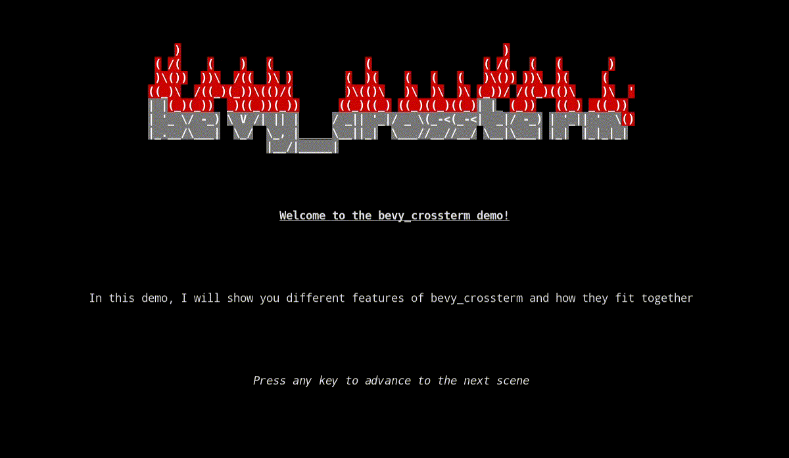

# 


## What is bevy_crossterm?

`bevy_crossterm` is a [Bevy](https://github.com/bevyengine/bevy) plugin that uses [crossterm](https://github.com/crossterm-rs/crossterm) as a renderer. It provides custom components and events which allow users to develop games for the terminal.


## Table of Contents

* [Features](#features)
* [Demo GIF](#demo-gif)
* [Getting Started](#getting-started)


## Features

- Sprites and styles with colors and attributes
    - Up to 24-bit color (depends on what the host terminal supports)
- Incremental drawing: Only draw on the screen when something has changed
- Transparency: Sprites can have holes so any sprites underneath will not be covered
- Position, show, and hide the cursor
- Set window title
- Plugs into Bevy's asset system so sprites and styles can be loaded from disk and also hot reloaded


## Demo GIF




## Getting Started

See the [examples](examples/) for runnable code and detailed comments.

```toml
[dependencies]
bevy = { version = "0.4", default-features = false }
bevy_crossterm = "0.4.0"
```

```rust
use bevy::prelude::*;
use bevy_crossterm::prelude::*;

pub fn main() {
    let mut settings = CrosstermWindowSettings::default();
    settings.set_title("Hello, World!");

    App::build()
        // Add our window settings
        .add_resource(settings)
        // Add the DefaultPlugins before the CrosstermPlugin. The crossterm plugin needs bevy's asset server, and if it's
        // not available you'll trigger an assert
        .add_plugins(DefaultPlugins)
        .add_plugin(CrosstermPlugin)
        .add_startup_system(startup_system.system())
        .run();
}

fn startup_system(
    commands: &mut Commands,
    mut sprites: ResMut<Assets<Sprite>>,
    mut stylemaps: ResMut<Assets<StyleMap>>,
) {
    commands
        .spawn(SpriteBundle {
            sprite: sprites.add(Sprite::new("Hello, world!")),
            stylemap: stylemaps.add(StyleMap::default()),
            ..Default::default()
        });
}
```

Press Control-c to exit at any time.
